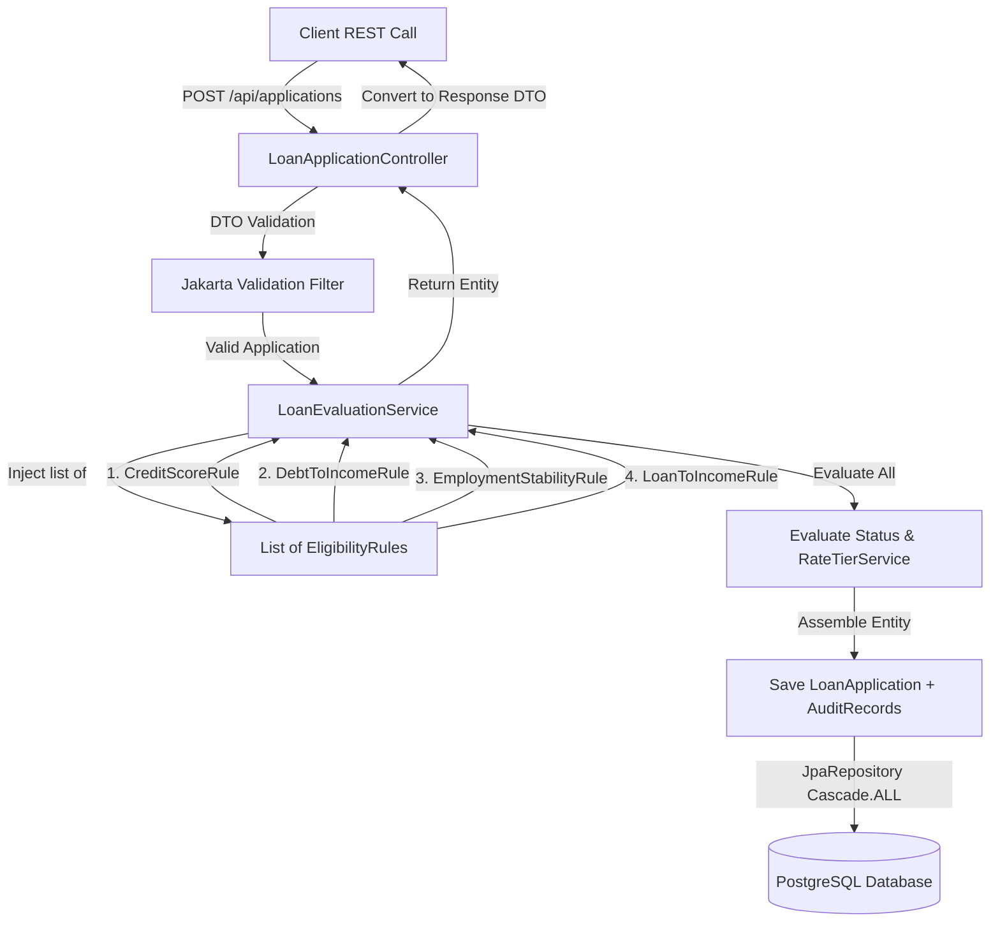

# CreditGate — Loan/Credit Approval Engine

A Spring Boot REST API that evaluates loan applications against a pluggable rule engine, assigns risk-based interest rate tiers, and records a full audit trail for every decision.

[](https://www.oracle.com/java/technologies/javase-downloads.html)
[](https://spring.io/projects/spring-boot)
[](https://maven.apache.org/)
[](https://www.postgresql.org/)
[](https://junit.org/junit5/)
[](./LICENSE)

---

## 1. What It Does

CreditGate is an automated financial eligibility evaluation engine. A user submits a loan application containing their financial metrics (income, credit score, existing debt, requested loan amount, and employment duration/status). The engine runs this application through a series of eligibility checks, issuing a final decision (`APPROVED` or `REJECTED`). If approved, the system assigns a corresponding interest rate and risk tier.

### Explanability via Decision Audit Trails
To ensure transparency and compliance, every rule evaluated for an application is recorded in a detailed audit log. Rather than returning a simple summary status, the engine details:
* **The name of every rule run** (e.g. Credit Score Rule, Debt-To-Income Rule).
* **The pass/fail outcome of that specific rule**.
* **A human-readable explanation containing the exact computed ratios and thresholds** (e.g. *"Debt-to-income ratio of 400.00% exceeds the maximum allowed threshold of 45%"*).

Because the engine is non-short-circuiting, every check is run and logged even if an earlier rule fails. This provides a complete breakdown of all eligibility factors for audit analysis.

> [!NOTE]
> All eligibility rule thresholds and interest rate bands used in this project are configured for **illustrative demonstration purposes only** as part of a portfolio engineering project, and do not constitute real financial or lending advice.

---

## 2. Eligibility Rules & Rate Tiering

### Core Eligibility Rules

The engine evaluates every application against these rules:

| Rule Name | Class Name | Target Criteria | Failure Condition |
| :--- | :--- | :--- | :--- |
| **Credit Score Rule** | `CreditScoreRule` | Credit score $\ge 600$ | Credit score $< 600$ |
| **Debt-to-Income (DTI) Rule** | `DebtToIncomeRule` | $\text{Monthly Debt} / \text{Monthly Income} \le 45\%$ | Ratio $> 45\%$ or Zero Income |
| **Employment Stability Rule** | `EmploymentStabilityRule` | $\text{Duration} \ge 12\text{ months}$ AND $\text{Status} \ne \text{"UNEMPLOYED"}$ | Duration $< 12\text{ months}$ OR Status = `UNEMPLOYED` (fails unemployed candidates immediately) |
| **Loan-to-Income (LTI) Rule** | `LoanToIncomeRule` | $\text{Loan Amount} / \text{Annual Income} \le 3.0\text{x}$ | Ratio $> 3.0\text{x}$ (where Annual Income = Monthly Income $\times$ 12) |

### Illustrative Interest Rate Tiering

Approved applications receive a risk-based rate tier based on their credit score band:

| Credit Score Band | Assigned Tier | Illustrative Interest Rate |
| :--- | :--- | :--- |
| $\ge 750$ | `TIER_A` (Excellent) | **5.50%** |
| $700$ to $749$ | `TIER_B` (Good) | **7.00%** |
| $600$ to $699$ | `TIER_C` (Fair) | **9.50%** |
| $< 600$ (Fails Credit Score Rule) | `NONE` | **N/A** (Rejected) |

---

## 3. API Endpoints

The API consists of the following REST and health monitoring endpoints:

| HTTP Method | Resource Path | Description |
| :--- | :--- | :--- |
| `POST` | `/api/applications` | Submits a loan application, runs the rules engine, and returns the decision + audit trail. |
| `GET` | `/api/applications/{id}` | Retrieves a past loan application's decision, risk tier, and its full step-by-step audit records. |
| `GET` | `/actuator/health` | Spring Boot Actuator endpoint returning database and application connection health. |

---

## 4. Quick Demo

Here are the real payloads and JSON responses retrieved directly from a running instance of the CreditGate API.

### A. Approved Application (Tier A)
An applicant with a high monthly income (80,000), excellent credit (780), and stable employment (24 months) requesting a standard loan amount (500,000).

#### Curl Request
```bash
curl -X POST http://localhost:8080/api/applications \
     -H "Content-Type: application/json" \
     -d '{
       "monthlyIncome": 80000.00,
       "creditScore": 780,
       "existingMonthlyDebt": 15000.00,
       "requestedLoanAmount": 500000.00,
       "employmentDurationMonths": 24,
       "employmentStatus": "EMPLOYED"
     }'
```

#### JSON Response
```json
{
  "id": "b66cdcf9-ce3e-4892-bc16-3b45ff855755",
  "monthlyIncome": 80000.00,
  "creditScore": 780,
  "existingMonthlyDebt": 15000.00,
  "requestedLoanAmount": 500000.00,
  "employmentDurationMonths": 24,
  "employmentStatus": "EMPLOYED",
  "status": "APPROVED",
  "interestRateTier": "TIER_A",
  "interestRate": 5.50,
  "createdAt": "2026-07-24T20:05:29.197959594",
  "auditTrail": [
    {
      "ruleName": "Credit Score Rule",
      "passed": true,
      "reason": "Credit score 780 meets the minimum requirement of 600.",
      "evaluatedAt": "2026-07-24T20:05:29.197991166"
    },
    {
      "ruleName": "Loan-To-Income Rule",
      "passed": true,
      "reason": "Requested loan amount of 500000.00 is 0.52x of annual income (960000.00), which is within the maximum limit of 3.0x.",
      "evaluatedAt": "2026-07-24T20:05:29.197991166"
    },
    {
      "ruleName": "Debt-To-Income Rule",
      "passed": true,
      "reason": "Debt-to-income ratio of 18.75% is within the maximum allowed threshold of 45%.",
      "evaluatedAt": "2026-07-24T20:05:29.197991166"
    },
    {
      "ruleName": "Employment Stability Rule",
      "passed": true,
      "reason": "Employment status is EMPLOYED and duration of 24 months meets the minimum requirement of 12 months.",
      "evaluatedAt": "2026-07-24T20:05:29.197991166"
    }
  ]
}
```

### B. Rejected Application (Non-Short-Circuiting)
An applicant with monthly income of 10,000, credit score of 650, stable employment, but carrying 40,000 in monthly debt. 
* *Outcome*: Credit Score, Employment, and Loan-To-Income rules pass, but the Debt-To-Income rule fails (400.00% DTI, far over the 45% cap). Note that the engine evaluates all rules rather than short-circuiting.

#### Curl Request
```bash
curl -X POST http://localhost:8080/api/applications \
     -H "Content-Type: application/json" \
     -d '{
       "monthlyIncome": 10000.00,
       "creditScore": 650,
       "existingMonthlyDebt": 40000.00,
       "requestedLoanAmount": 80000.00,
       "employmentDurationMonths": 24,
       "employmentStatus": "EMPLOYED"
     }'
```

#### JSON Response
```json
{
  "id": "fa05da25-c941-43bd-b69e-06ac40f81baa",
  "monthlyIncome": 10000.00,
  "creditScore": 650,
  "existingMonthlyDebt": 40000.00,
  "requestedLoanAmount": 80000.00,
  "employmentDurationMonths": 24,
  "employmentStatus": "EMPLOYED",
  "status": "REJECTED",
  "interestRateTier": "NONE",
  "interestRate": null,
  "createdAt": "2026-07-24T20:05:32.627750941",
  "auditTrail": [
    {
      "ruleName": "Credit Score Rule",
      "passed": true,
      "reason": "Credit score 650 meets the minimum requirement of 600.",
      "evaluatedAt": "2026-07-24T20:05:32.627781992"
    },
    {
      "ruleName": "Loan-To-Income Rule",
      "passed": true,
      "reason": "Requested loan amount of 80000.00 is 0.67x of annual income (120000.00), which is within the maximum limit of 3.0x.",
      "evaluatedAt": "2026-07-24T20:05:32.627781992"
    },
    {
      "ruleName": "Debt-To-Income Rule",
      "passed": false,
      "reason": "Debt-to-income ratio of 400.00% exceeds the maximum allowed threshold of 45%.",
      "evaluatedAt": "2026-07-24T20:05:32.627781992"
    },
    {
      "ruleName": "Employment Stability Rule",
      "passed": true,
      "reason": "Employment status is EMPLOYED and duration of 24 months meets the minimum requirement of 12 months.",
      "evaluatedAt": "2026-07-24T20:05:32.627781992"
    }
  ]
}
```

### C. Fetch Decision by ID

#### Curl Request
```bash
curl -X GET http://localhost:8080/api/applications/b66cdcf9-ce3e-4892-bc16-3b45ff855755
```

#### JSON Response
*(Returns the same structure as the approval response above).*

---

## 5. Running Locally

### Prerequisites
* **Java 17** (or 21) installed.
* **Maven 3.8+** installed.
* **Docker & Docker Compose** installed.

### Option A: Run via Docker Compose (Recommended)
Builds the jar file locally and starts PostgreSQL and the app containers with startup ordering:
```bash
docker-compose up --build
```
This command automatically:
1. Boots the PostgreSQL database container and verifies its health.
2. Compiles and packages the application.
3. Launches the Spring Boot app on port `8080`.
4. Executes the Flyway schema migrations on the database.

To verify that the application has booted and connected to the database successfully, check the health endpoint:
```bash
curl http://localhost:8080/actuator/health
```
**Response**: `{"status":"UP"}`

### Option B: Run Locally (Maven + Local PostgreSQL)
1. Ensure a PostgreSQL instance is running on `localhost:5432` with a database named `creditgate`.
2. Configure credentials in environment variables or edit `src/main/resources/application.properties`.
3. Build and package the application:
   ```bash
   mvn clean package
   ```
4. Run the application:
   ```bash
   mvn spring-boot:run
   ```

### Interactive Documentation (Swagger UI)
With the application running, open your web browser and navigate to:
👉 **[http://localhost:8080/swagger-ui/index.html](http://localhost:8080/swagger-ui/index.html)**

This interface allows you to submit applications and view their audit trail interactively.

---

## 6. Tech Stack

| Layer | Technology | Details |
| :--- | :--- | :--- |
| **Language** | Java 17 | Core programming language |
| **Framework** | Spring Boot 3.3.2 | Application container & dependency injection |
| **ORM** | Spring Data JPA / Hibernate | Object-Relational Mapping framework |
| **Database** | PostgreSQL 16 | Relational persistent store |
| **Migrations** | Flyway 10 | Version-controlled database migrations |
| **Validation** | Jakarta Bean Validation | Input constraint enforcement |
| **Metrics & Health** | Spring Boot Actuator | Exposes application status checks |
| **API Documentation** | Springdoc OpenAPI / Swagger UI | Interactive endpoint testing and specs |
| **Testing** | JUnit 5 + Mockito + MockMvc | Automated unit and web layer integration tests |
| **Build Tool** | Maven 3.x | Build and dependency manager |
| **Containerization** | Docker / Docker Compose | Container compilation and orchestration |

---

## 7. Architecture

### Request Life Cycle Flow



### Key Design Decisions

* **Pluggable Rules Engine**: We define an `EligibilityRule` interface. Each rule is a separate class annotated with `@Component`. `LoanEvaluationService` injects a `List<EligibilityRule>`, and Spring Boot automatically collects all eligibility rule beans into this list. Adding a new rule later only requires writing one new class; the evaluation service remains unchanged.
* **Non-Short-Circuiting Evaluation**: The engine iterates through *every* rule in the list regardless of previous failures. This prevents hiding secondary failure causes, giving the user a complete audit record.
* **Clean Data Separation (DTO Pattern)**: Request payloads and response objects are decoupled from internal JPA database entities, ensuring encapsulation and security.
* **Flyway Schema Validation**: Database schemas are strictly version-controlled using Flyway SQL migrations. Hibernate is set to `validate` mode, disabling automatic DB alterations by ORM during runtime.
* **Centralized Exception Handling**: A `@RestControllerAdvice` class handles system errors and input constraints, translating validation constraints into clean, standardized JSON errors.

---

## 8. Tests

The project includes unit testing for all boundary thresholds, service mock evaluations, and WebMvc controller integration flows. 

To execute the test suite:
```bash
mvn clean test
```

### Coverage Scope (30 Tests Passing, 0 Failures)
* **Rule Boundary Tests (`rules/` package)**:
  - `CreditScoreRuleTest` verifies values 599, 600, and 601.
  - `DebtToIncomeRuleTest` verifies boundary DTI values 44.9%, 45.0%, and 45.1%, plus zero-income edge cases.
  - `EmploymentStabilityRuleTest` verifies duration boundaries (11/12 months) and checks that status `UNEMPLOYED` triggers a failure regardless of duration.
  - `LoanToIncomeRuleTest` verifies boundary multiples (2.99x, 3.00x, 3.01x) and verifies monthly-to-annual income conversion.
* **Service Tests (`service/` package)**:
  - `RateTierServiceTest` verifies rate tier and percentage boundary mappings at scores 599/600, 699/700, and 749/750.
  - `LoanEvaluationServiceTest` mocks the list of rules to ensure non-short-circuiting logic executes all rules and records audit logs to the repository.
* **Integration Tests (`controller/` package)**:
  - `LoanApplicationControllerIntegrationTest` uses MockMvc to test REST endpoint serialization, validation error checks (returning 400 Bad Request with details), and resource not found exceptions (returning 404 Not Found).

---

## 9. Project Structure

```
d:/GAIN/Projects/Credit-Gate
├── LICENSE
├── pom.xml
├── Dockerfile
├── docker-compose.yml
├── README.md
└── src
    ├── main
    │   ├── java
    │   │   └── com
    │   │       └── creditgate
    │   │           ├── CreditGateApplication.java
    │   │           ├── config
    │   │           │   └── OpenApiConfig.java
    │   │           ├── controller
    │   │           │   └── LoanApplicationController.java
    │   │           ├── dto
    │   │           │   ├── LoanApplicationRequest.java
    │   │           │   ├── LoanDecisionResponse.java
    │   │           │   └── RuleEvaluationDto.java
    │   │           ├── entity
    │   │           │   ├── LoanApplication.java
    │   │           │   ├── AuditRecord.java
    │   │           │   ├── DecisionStatus.java
    │   │           │   └── InterestRateTier.java
    │   │           ├── exception
    │   │           │   ├── ErrorResponse.java
    │   │           │   ├── GlobalExceptionHandler.java
    │   │           │   └── ResourceNotFoundException.java
    │   │           ├── repository
    │   │           │   ├── LoanApplicationRepository.java
    │   │           │   └── AuditRecordRepository.java
    │   │           ├── rules
    │   │           │   ├── EligibilityRule.java
    │   │           │   ├── RuleResult.java
    │   │           │   ├── CreditScoreRule.java
    │   │           │   ├── DebtToIncomeRule.java
    │   │           │   ├── EmploymentStabilityRule.java
    │   │           │   └── LoanToIncomeRule.java
    │   │           └── service
    │   │               ├── LoanEvaluationService.java
    │   │               └── RateTierService.java
    │   └── resources
    │       ├── application.properties
    │       └── db
    │           └── migration
    │               └── V1__init_schema.sql
    └── test
        └── java
            └── com
                └── creditgate
                    ├── rules
                    │   ├── CreditScoreRuleTest.java
                    │   ├── DebtToIncomeRuleTest.java
                    │   ├── EmploymentStabilityRuleTest.java
                    │   └── LoanToIncomeRuleTest.java
                    ├── service
                    │   ├── LoanEvaluationServiceTest.java
                    │   └── RateTierServiceTest.java
                    └── controller
                        └── LoanApplicationControllerIntegrationTest.java
```

---

## 10. License

Free to use and Modify
